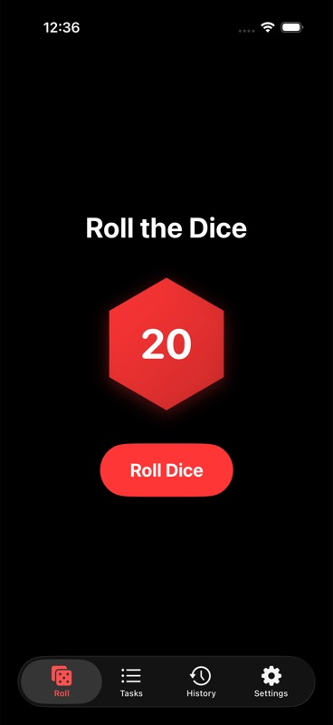

# Roll2Do

A small hobby iOS app I built to gamify my chores. For each task I roll a virtual d20 against a difficulty class. If I succeed the DC resets. If I fail it ticks down.

The point isn't the app. The point is that it's a personal learning space where I can solve real engineering problems the way I would in a large codebase, even though the surface area is small.

If something here looks like overkill for a chore app, that's the point. I'd rather work through the tradeoffs on a toy than learn them under deadline pressure.

## Screenshot

  

